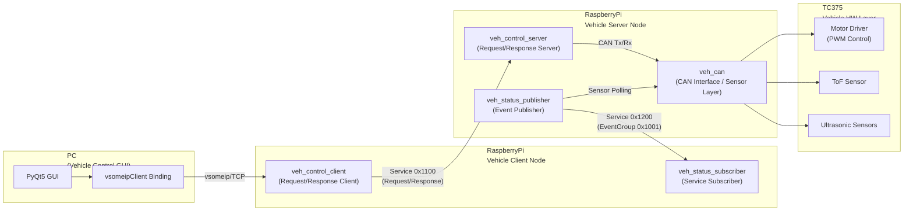

# 🚘 Project SYNAPSE 
**Service-Oriented Vehicle Control Platform (RPi ↔ TC375)** 

## 📘 개요 (Overview) 
Project SYNAPSE는 차량 제어 기능을 서비스 단위로 분리하여 통신하는 SOA(Service-Oriented Architecture) 기반 차량 제어 플랫폼입니다. 
라즈베리파이(Raspberry Pi)를 게이트웨이 노드로, 인피니언 AURIX TC375 보드를 제어 노드(ECU) 로 구성하여, vsomeip 프로토콜을 이용한 차량 서비스 통신을 구현합니다. 

## 🧠 프로젝트 이름의 의미 (Why “SYNAPSE”?) 
‘Synapse(시냅스)’는 신경세포(Neuron) 간의 연결부로, 신호를 주고받아 움직임과 반응을 가능하게 하는 매개체입니다. 이 프로젝트는 자동차 내 각 제어 기능(주행, AEB, AutoPark, Auth 등)을 하나의 시스템이 아닌, 서비스 간 신호 전달 구조로 연결하고자 합니다. 즉, SYNAPSE라는 이름은 “차량의 각 기능이 독립적으로 존재하면서도, vsomeip라는 신경망을 통해 유기적으로 연결되는 구조” 를 상징합니다. 

## 🧩 시스템 아키텍처 (System Architecture)


## ⚙️ 디렉터리 구조 (Directory Layout)
```
project_synapse/
│
├── CMakeLists.txt
├── README.md
│
├── common/
│   ├── veh_control_service.hpp      # 명령 서비스 정의 (cmd_type, ID 등)
│   ├── veh_status_service.hpp       # 상태 서비스 정의 (status_type 등)
│   ├── veh_can.hpp                  # RPi ↔ TC375 CAN 송수신 공통 함수
│   ├── veh_logger.hpp               # 로그 유틸 (레벨별 파일 출력)
│   ├── veh_types.hpp                # typedef, enum, 구조체 등
│   └── config.hpp                   # 환경설정 (네트워크, 인터페이스 등)
│
├── server/
│   ├── veh_control_server.cpp       # vsomeip 서버: 명령 수신 → CAN 송신
│   ├── veh_status_publisher.cpp     # 상태/센서 이벤트 송신
│   ├── veh_can_tx.cpp               # SocketCAN 송신 구현부
│   └── CMakeLists.txt
│
├── client/
│   ├── veh_control_client.cpp       # vsomeip 클라이언트: 명령 송신
│   ├── veh_status_subscriber.cpp    # 상태 Event 수신
│   ├── veh_cli.cpp                  # CLI 기반 테스트 (키보드 입력)
│   ├── veh_gui.py                   # PyQt GUI 제어기 (PC 실행용)
│   └── CMakeLists.txt
│
├── bindings/
│   ├── synapse_vsomeip.cpp          # pybind11 바인딩 (Python ↔ C++ 연결)
│   └── CMakeLists.txt (추가 권장)   # pybind11 빌드 규칙 명시
│
├── resources/
│   ├── veh_server.json              # vsomeip 서버 설정 (unicast, service, port)
│   ├── veh_client.json              # vsomeip 클라이언트 설정
│   └── can_config.json              # CAN 설정 (bitrate, interface 등)
│
└── logs/
    ├── veh_server.log
    ├── veh_client.log
    ├── veh_status_publisher.log
    └── veh_status_subscriber.log
```

## 🧭 계층 구조
| 계층 | 주요 구성 요소 | 설명 |
| --- | --- | --- |
| **Application Layer** | `veh_control_server`, `veh_status_publisher` | 차량 기능 단위 서비스 (제어/상태) 제공 |
| **Middleware Layer (vsomeip)** | `veh_control_client`, `veh_status_subscriber` | 서비스 검색, 메시지 라우팅, 이벤트 관리 수행 |
| **Hardware Abstraction Layer (HAL)** | `veh_can`, `veh_motor`, `veh_tof` | 센서·액추에이터 접근 추상화 |
| **Hardware Layer** | `TC375`, `센서 모듈` | 실제 물리적 장치 및 인터페이스 |

## 🛰 통신 프로토콜
| 구분 | 방식 | QoS | 설명 |
| --- | --- | --- | --- |
| **veh_control_service** | Request / Response | TCP (reliable) | 클라이언트 명령 기반 제어 (예: 전진, 후진, 회전 등) |
| **veh_status_service** | Publish / Subscribe | UDP (unreliable) | 차량 상태 브로드캐스트 (예: Drive, AEB, ToF 등) |
| **Service Discovery (SD)** | Multicast | UDP (224.224.224.245:30490) | 서비스 자동 탐색 및 구독 관리 |
| **CAN Communication** | Frame-based | Reliable (Polling) | MCU ↔ Sensor 간 데이터 송수신 |

## 🧠 서비스 정의
| 서비스명                    | 역할     | 통신 방향           | 설명                                      |
| ----------------------- | ------ | --------------- | --------------------------------------- |
| **veh_control_service** | 명령 제어  | Client → Server | 차량 제어를 위한 Request/Response 기반 서비스로, 사용자 명령(전진, 후진, 조향, AEB 등)을 전달하여 서버가 실제 하드웨어를 제어함  |
| **veh_status_service**  | 상태 피드백 | Server → Client | 차량 상태를 주기적으로 Publish하는 Event 기반 서비스로, Drive 상태, AEB, ToF 거리 등 주요 정보를 Subscriber에게 전송함 | 

## 🔧 빌드 & 실행 (Build & Run) 
### 1️⃣ 빌드
```bash
mkdir build && cd build
cmake ..
make -j4
```
### 2️⃣ 실행 순서
```bash
# 서버 (RPi)
./server/veh_control_server

# 클라이언트 (RPi or PC)
./client/veh_control_client
```
### 3️⃣ GUI 실행 (선택사항)
```bash
python3 ./client/veh_gui.py
```

## 🧾 로그 관리 
| 파일                    | 내용                      |
| --------------------- | ----------------------- |
| `logs/veh_client.log` | 클라이언트 명령 송신 / GUI 입력 로그 |
| `logs/veh_server.log` | 서버 수신 / CAN 송신 로그       |
| `logs/veh_status.log` | (선택) 이벤트 상태 피드백 로그      |


## 🧑‍💻 개발 환경 (Environment)
| 항목            | 내용                             |
| ------------- | ------------------------------ |
| **OS**        | Ubuntu 22.04 / Raspberry Pi OS |
| **Language**  | C++17 / Python 3.11            |
| **Framework** | vsomeip 3.5.7 / PyQt5          |
| **MCU**       | Infineon AURIX TC375 LiteKit   |
| **Comm**      | SocketCAN (`can0`)             |
