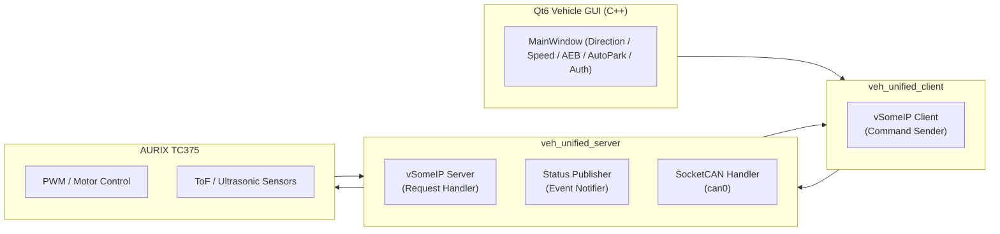

# 🚘 Project SYNAPSE 
**Service-Oriented Vehicle Control Platform (RPi ↔ TC375)** 

## 📘 개요 (Overview) 
Project SYNAPSE는 차량 제어 기능을 서비스 단위로 분리하여 통신하는 SOA(Service-Oriented Architecture) 기반 차량 제어 플랫폼입니다. 
라즈베리파이(Raspberry Pi)를 게이트웨이 노드로, 인피니언 AURIX TC375 보드를 제어 노드(ECU) 로 구성하여, vsomeip 프로토콜을 이용한 차량 서비스 통신을 구현합니다. 
- Raspberry Pi ↔ Infineon AURIX TC375 보드 간 Ethernet + SocketCAN 통신
- SOA(Service-Oriented Architecture) 기반의 모듈화된 제어 서비스
- Qt6 GUI 기반의 직관적 차량 제어 및 상태 시각화

## 🧠 프로젝트 이름의 의미 (Why “SYNAPSE”?) 
‘Synapse(시냅스)’는 신경세포(Neuron) 간의 연결부로, 신호를 주고받아 움직임과 반응을 가능하게 하는 매개체입니다. 이 프로젝트는 자동차 내 각 제어 기능(주행, AEB, AutoPark, Auth 등)을 하나의 시스템이 아닌, 서비스 간 신호 전달 구조로 연결하고자 합니다. 즉, SYNAPSE라는 이름은 “차량의 각 기능이 독립적으로 존재하면서도, vsomeip라는 신경망을 통해 유기적으로 연결되는 구조” 를 상징합니다. 

## 🧩 시스템 아키텍처 (System Architecture)


## ⚙️ 디렉터리 구조 (Directory Layout)
```
pproject_synapse/
│
├── CMakeLists.txt
│   └── 전체 프로젝트 빌드 스크립트 (공용 옵션, vSomeIP / Qt / pybind 빌드 설정)
│
├── README.md
│   └── 프로젝트 개요 및 빌드/실행 가이드
│
├── common/
│   ├── veh_control_service.hpp      # 명령 서비스 정의 (cmd_type, service_id, method_id 등)
│   ├── veh_status_service.hpp       # 상태 서비스 정의 (status_type, event_id 등)
│   ├── veh_can.hpp                  # RPi ↔ TC375 간 SocketCAN 송수신 공통 함수
│   ├── veh_logger.hpp               # 로그 유틸리티 (레벨별 파일 출력 및 콘솔 출력)
│   ├── veh_types.hpp                # typedef, enum, 구조체 등 데이터 형 정의
│   └── config.hpp                   # 시스템 환경설정 (네트워크, 인터페이스, CAN ID 등)
│
├── server/
│   ├── veh_control_server.cpp       # vSomeIP 서버: 클라이언트 명령 수신 → CAN 메시지 송신
│   ├── veh_status_publisher.cpp     # 상태/센서 이벤트 송신 (AEB, AutoPark, ToF 등)
│   ├── veh_can_tx.cpp               # SocketCAN 송신 구현부 (CAN 전송 API)
│   ├── veh_unified_server.cpp       # 통합 서버 실행 진입점 (Control + Status 서비스 병합)
│   └── CMakeLists.txt               # 서버 빌드 설정 (vsomeip 링크, 컴파일 옵션 등)
│
├── client/
│   ├── veh_control_client.cpp       # vSomeIP 클라이언트: 사용자 명령 송신
│   ├── veh_status_subscriber.cpp    # vSomeIP Event 수신 (서버 상태 구독)
│   ├── veh_cli.cpp                  # CLI 기반 제어 프로그램 (키보드 입력으로 테스트)
│   ├── veh_unified_client.cpp       # 통합 클라이언트 실행 진입점 (Control + Status 구독)
│   └── CMakeLists.txt               # 클라이언트 빌드 설정
│
├── resources/
│   ├── veh_server.json              # vSomeIP 서버 설정 (unicast, port, service/instance ID 등)
│   ├── veh_client.json              # vSomeIP 클라이언트 설정
│   ├── veh_unified_server.json      # 통합 서버용 설정 (Control + Status 서비스 포함)
│   └── veh_unified_client.json      # 통합 클라이언트용 설정 (Service Discovery 포함)
│
├── gui_client/
│   ├── main.cpp                     # Qt 진입점 (QApplication 초기화 및 MainWindow 실행)
│   ├── mainwindow.h                 # GUI 클래스 선언부 (UI 컴포넌트 정의)
│   ├── mainwindow.cpp               # GUI 로직 (방향키, 슬라이더, 버튼 이벤트 처리)
│   ├── vsclientthread.h             # vSomeIP 통신 스레드 클래스 선언부
│   ├── vsclientthread.cpp           # vSomeIP 클라이언트 스레드 (Qt Signal/Slot 연동)
│   └── CMakeLists.txt               # Qt GUI 빌드 설정 (Qt6 Widgets + vsomeip 링크)
│
└── logs/
    ├── veh_server.log               # 서버 수신/전송 로그
    ├── veh_client.log               # 클라이언트 송신 로그
    ├── veh_status_publisher.log     # 상태 이벤트 송신 로그
    ├── veh_status_subscriber.log    # 상태 이벤트 수신 로그
    ├── veh_unified_server.log       # 통합 서버 로그 (Control + Status 서비스)
    └── veh_unified_client.log       # 통합 클라이언트 로그 (GUI 포함)
```

## 🧭 계층 구조
| 계층                                   | 주요 구성 요소                                                       | 설명                                                                                              |
| ------------------------------------ | -------------------------------------------------------------- | ----------------------------------------------------------------------------------------------- |
| **Application Layer**                | `veh_unified_server`, `veh_unified_client`, `gui_client (Qt6)` | 차량 제어·상태 모니터링을 수행하는 상위 응용 계층. <br>GUI를 통한 명령 송신 및 실시간 상태 표시 제공                                  |
| **Middleware Layer (vSomeIP)**       | `veh_control_service`, `veh_status_service`                    | 서비스 검색(SD), Request/Response 및 Event Publish/Subscribe 관리. <br>Ethernet 상에서 차량 기능 단위 서비스 통신을 담당 |
| **Hardware Abstraction Layer (HAL)** | `veh_can`, `veh_motor`, `veh_tof`, `veh_ultrasonic`            | 센서/액추에이터 접근 추상화 계층. <br>CAN 인터페이스를 통해 TC375 MCU와 상호 작용                                          |
| **Hardware Layer**                   | `Infineon TC375`, `Sensor Modules (ToF, Ultrasonic)`           | 실제 물리 장치 계층. 모터, 거리센서 등 하드웨어 동작 수행                                                              |

## 🛰 통신 프로토콜
| 구분                         | 방식                                | QoS                | 설명                                                      |
| -------------------------- | --------------------------------- | ------------------ | ------------------------------------------------------- |
| **veh_control_service**    | Request / Response                | TCP (Reliable)     | 클라이언트 → 서버 방향 명령 전송 (예: 전진, 후진, 회전 등)                   |
| **veh_status_service**     | Publish / Subscribe               | UDP (Unreliable)   | 서버 → 클라이언트 방향 실시간 상태 전송 (예: AEB, AutoPark, ToF, Auth 등) |
| **Service Discovery (SD)** | Multicast (224.224.224.245:30490) | UDP                | vSomeIP 기반 서비스 자동 탐색 및 구독 관리                            |
| **CAN Communication**      | Frame-based                       | Reliable (Polling) | RPi ↔ TC375 간 센서/모터 제어 및 상태 데이터 교환 (SocketCAN 사용)       |


## 🧠 서비스 정의
| 서비스명                    | 역할     | 통신 방향           | 설명                                      |
| ----------------------- | ------ | --------------- | --------------------------------------- |
| **veh_control_service** | 명령 제어  | Client → Server | 차량 제어를 위한 Request/Response 기반 서비스로, 사용자 명령(전진, 후진, 조향, AEB 등)을 전달하여 서버가 실제 하드웨어를 제어함  |
| **veh_status_service**  | 상태 피드백 | Server → Client | 차량 상태를 주기적으로 Publish하는 Event 기반 서비스로, AEB, ToF 거리, 로그인 상태 등 주요 정보를 Subscriber에게 전송함 | 

## 💬 Command & Status 정의
▶ Command (Client → Server)
| cmd_type | 기능                     | 설명                       | Payload 예시                          |
| -------- | ---------------------- | ------------------------ | ----------------------------------- |
| `0x01`   | **Drive Direction**    | RC카 방향 (전진/후진/좌/우/대각/정지) | `01 08 00 00 00 00 00 00` (Forward) |
| `0x02`   | **Drive Speed (Duty)** | PWM Duty 0~100%          | `02 46 00 00 00 00 00 00` (70%)     |
| `0x03`   | **AEB Control**        | AEB ON/OFF 제어            | `03 01 00 00 00 00 00 00` (ON)      |
| `0x04`   | **AutoPark Control**   | AutoPark 시작              | `04 01 00 00 00 00 00 00` (Start)   |
| `0x05`   | **Auth Password**      | 문자열 인증                   | `05 31 32 33 34 00 00 00` (“1234”)  |
| `0xFE`   | **Fault / Emergency**  | 비상정지 또는 리셋               | `FE 01 00 00 00 00 00 00` (Stop)    |
◀ Status (Server → Client)
| status_type | 이름                 | 설명                           | 예시 값                                                  | 전송 주기     | 트리거       |
| ----------- | ------------------ | ---------------------------- | ----------------------------------------------------- | --------- | --------- |
| **0x01**    | **AEB_STATE**      | 자동 긴급제동 활성 상태                | `0x00=OFF`, `0x01=ON`                                 | on-change | AEB 상태 전환 |
| **0x02**    | **AUTOPARK_STATE** | 자율주차 단계                      | `0x01=Scanning`<br>`0x02=Parking`<br>`0x03=Completed` | on-change | 단계 전환     |
| **0x03**    | **TOF_DISTANCE**   | 전방 ToF 센서 거리(mm, big-endian) | ex. `01 F4` → 500 mm                                  | 500 ms    | 주기적       |
| **0x04**    | **AUTH_STATE**     | 인증 결과                        | `0x00=FAIL`, `0x01=SUCCESS`                           | on-change | 인증 시점     |

## 🖥️ Qt GUI Features
| 구분                   | 설명                                                   |
| -------------------- | ---------------------------------------------------- |
| **Direction Pad**    | 8방향 제어 + 중앙 정지 버튼 (↖ ↑ ↗ ← ■ → ↙ ↓ ↘)                |
| **Speed Slider**     | PWM Duty 0–1000 단위 (10 단위 Step)                      |
| **AEB Control**      | Enable / Disable 버튼으로 AEB 상태 토글                      |
| **AutoPark Control** | Start 버튼 → 진행 상태 표시 (Scanning → Parking → Completed) |
| **Auth Input**       | Password 입력창 + Login 버튼 → Auth Result 표시 (OK / Fail) |
| **Status Panel**     | 실시간 상태 (AEB, AutoPark, ToF, Auth) 표시                 |
| **Log Viewer**       | Request/Response/Event 로그 실시간 출력                     |


## 🔧 빌드 & 실행 (Build & Run) 
### 1️. 빌드
```bash
mkdir -p build && cd build
cmake .. -DCMAKE_BUILD_TYPE=Release
make -j4
```
### 2️. 서버 실행
```bash
cd ~/project/project_synapse/build/server
export VSOMEIP_CONFIGURATION=~/project/project_synapse/resources/veh_unified_server.json
export VSOMEIP_APPLICATION_NAME=veh_unified_server
./veh_unified_server
```
### 3. 클라이언트 실행
```bash
cd ~/project/project_synapse/build/client
export VSOMEIP_CONFIGURATION=~/project/project_synapse/resources/veh_unified_client.json
export VSOMEIP_APPLICATION_NAME=veh_unified_client
export LD_LIBRARY_PATH=/usr/local/lib:$LD_LIBRARY_PATH
./veh_unified_client
```
### 4. GUI 실행
```bash
export LD_LIBRARY_PATH=/usr/local/lib:$LD_LIBRARY_PATH
cd ~/project/project_synapse/build/gui_client
./gui_client
```

## 🧾 로그 관리 
| 파일                    | 내용                      |
| --------------------- | ----------------------- |
| `logs/veh_unified_client.log` | 클라이언트 명령 송신 / 이벤트 수신 |
| `logs/veh_unified_server.log` | 서버 수신 / CAN 송신 로그       |
| `logs/veh_unified_client_qt.log` | Qt GUI 로그      |


## 🧑‍💻 개발 환경 (Environment)
| 항목                      | 내용                                              |
| ----------------------- | ----------------------------------------------- |
| **OS**                  | Ubuntu 22.04 LTS / Raspberry Pi OS (Bullseye)   |
| **Language**            | C++17                                           |
| **Framework / Library** | Qt 6.5+, vSomeIP 3.5.7                          |
| **Build System**        | CMake 3.14+, GCC 11                             |
| **MCU**                 | Infineon AURIX TC375 LiteKit                    |
| **Communication**       | Ethernet (vSomeIP) + SocketCAN (`can0`)         |
| **GUI**                 | Qt6 Widgets 기반 C++ GUI (MainWindow / Thread 구조) |

