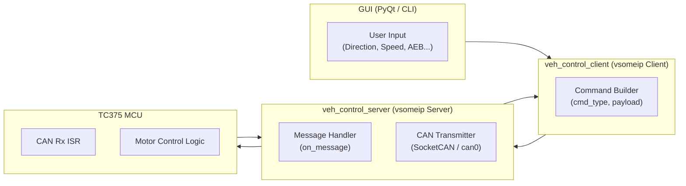
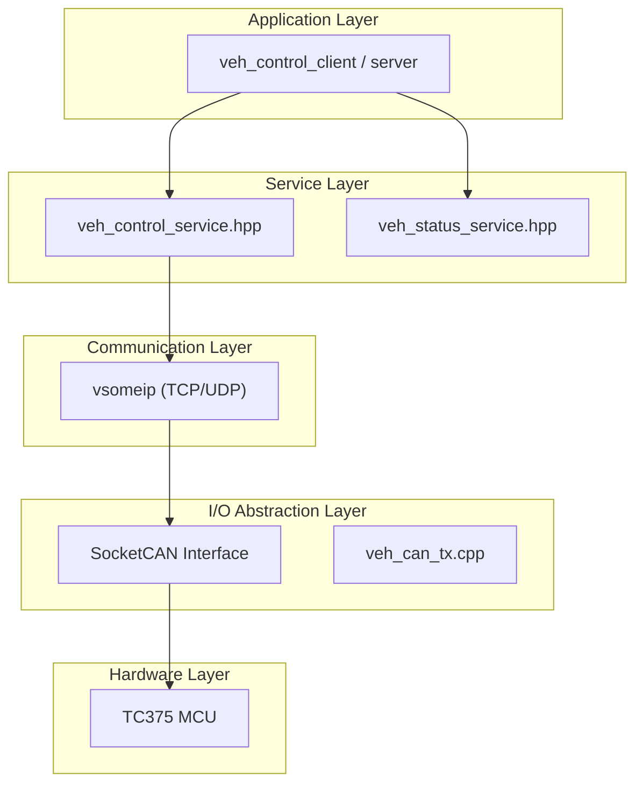

# 🚘 Project SYNAPSE 
**Service-Oriented Vehicle Control Platform (RPi ↔ TC375)** 

## 📘 개요 (Overview) 
Project SYNAPSE는 차량 제어 기능을 서비스 단위로 분리하여 통신하는 SOA(Service-Oriented Architecture) 기반 차량 제어 플랫폼입니다. 
라즈베리파이(Raspberry Pi)를 게이트웨이 노드로, 인피니언 AURIX TC375 보드를 제어 노드(ECU) 로 구성하여, vsomeip 프로토콜을 이용한 차량 서비스 통신을 구현합니다. 

## 🧠 프로젝트 이름의 의미 (Why “SYNAPSE”?) 
‘Synapse(시냅스)’는 신경세포(Neuron) 간의 연결부로, 신호를 주고받아 움직임과 반응을 가능하게 하는 매개체입니다. 이 프로젝트는 자동차 내 각 제어 기능(주행, AEB, AutoPark, Auth 등)을 하나의 시스템이 아닌, 서비스 간 신호 전달 구조로 연결하고자 합니다. 즉, SYNAPSE라는 이름은 “차량의 각 기능이 독립적으로 존재하면서도, vsomeip라는 신경망을 통해 유기적으로 연결되는 구조” 를 상징합니다. 

## 🧩 시스템 아키텍처 (System Architecture)

- Client (RPi/PC) : 사용자의 입력(GUI/CLI)을 받아 vsomeip 요청 전송
- Server (RPi) : 요청 수신 후 SocketCAN을 통해 TC375로 명령 전송
- TC375 : CAN Rx 인터럽트를 통해 수신한 명령에 따라 실제 모터 제어

## ⚙️ 디렉터리 구조 (Directory Layout)
```
project_synapse/
│
├── CMakeLists.txt
├── README.md
│
├── common/
│   ├── veh_control_service.hpp      # 명령 서비스 정의 (cmd_type, ID 등)
│   ├── veh_status_service.hpp       # 상태 서비스 정의 (status_type 등)
│   ├── veh_can.hpp                  # RPi ↔ TC375 CAN 송수신 공통 함수
│   ├── veh_logger.hpp               # 로그 유틸 (레벨별 파일 출력)
│   ├── veh_types.hpp                # typedef, enum, 구조체 등
│   └── config.hpp                   # 환경설정 (인터페이스명, 포트 등)
│
├── server/
│   ├── veh_control_server.cpp       # vsomeip 서버: 명령 수신 → CAN 송신
│   ├── veh_status_publisher.cpp     # 상태/센서 이벤트 송신
│   ├── veh_can_tx.cpp               # SocketCAN 송신 구현부
│   └── CMakeLists.txt
│
├── client/
│   ├── veh_control_client.cpp       # vsomeip 클라이언트: 명령 송신
│   ├── veh_status_subscriber.cpp    # 상태 Event 수신
│   ├── veh_cli.cpp                  # CLI 기반 테스트 (키보드 입력)
│   ├── veh_gui.py                   # PyQt GUI 제어기
│   └── CMakeLists.txt
│
├── bindings/
│   └── synapse_vsomeip.cpp          # pybind11 바인딩 (Python 모듈)
│
├── logs/
│   ├── veh_server.log
│   ├── veh_client.log
│   └── ...
│
└── resources/
    ├── vsomeip_server.json          # vsomeip 서버 설정
    ├── vsomeip_client.json          # vsomeip 클라이언트 설정
    └── can_config.json              # CAN 인터페이스 설정 (bitrate 등)
```

## 🧠 서비스 정의 (Service Overview)
| 서비스명                    | 역할     | 통신 방향           | 설명                                      |
| ----------------------- | ------ | --------------- | --------------------------------------- |
| **veh_control_service** | 명령 제어  | Client → Server | 주행, 속도, AEB, AutoPark, Auth 등 통합 명령 처리  |
| **veh_status_service**  | 상태 피드백 | Server → Client | 주행 상태, 거리(ToF), Fault, Auth 결과 등 이벤트 송신 | 

## 🛰️ 통신 프로토콜 (VSOMEIP Payload) 
🔹 Command Payload (Request) 
| cmd_type | 기능                 | 예시 (8B Payload)                          |
| -------- | ------------------ | ---------------------------------------- |
| `0x01`   | Drive Direction    | `01 08 00 00 00 00 00 00`                |
| `0x02`   | Drive Speed (Duty) | `02 46 00 00 00 00 00 00`                |
| `0x03`   | AEB Control        | `03 01 00 00 00 00 00 00`                |
| `0x04`   | AutoPark Control   | `04 01 00 00 00 00 00 00`                |
| `0x05`   | Auth Password      | `05 31 32 33 34 00 00 00` (ASCII “1234”) |
| `0xFE`   | Fault/Emergency    | `FE 01 00 00 00 00 00 00`                |

🔹 Status Payload (Event)
| status_type | 의미          | 예시                            |
| ----------- | ----------- | ----------------------------- |
| `0x01`      | Drive 상태    | `[0x01][0x08]` → 전진           |
| `0x02`      | AEB 상태      | `[0x02][0x01]` → AEB ON       |
| `0x03`      | AutoPark 단계 | `[0x03][0x02]` → 회전 단계        |
| `0x04`      | ToF 거리(cm)  | `[0x04][0x00][0x7F]` → 127cm  |
| `0x05`      | Fault 코드    | `[0x05][0x10]` → Sensor Fault |
| `0x06`      | Auth 상태     | `[0x06][0x01]` → 인증 성공        |


## 🧭 AUTOSAR 계층 구조 (Software Layering)

- Application Layer : 주행 제어/상태 처리 로직
- Service Layer : Command / Event 인터페이스 정의
- Communication Layer : vsomeip 기반 데이터 송수신
- I/O Layer : SocketCAN을 통해 실제 하드웨어 제어
- Hardware Layer : TC375 MCU

## 🔧 빌드 & 실행 (Build & Run) 
### 1️⃣ 빌드
```bash
mkdir build && cd build
cmake ..
make -j4
```
### 2️⃣ 실행 순서
```bash
# 서버 (RPi)
./server/veh_control_server

# 클라이언트 (RPi or PC)
./client/veh_control_client
```
### 3️⃣ GUI 실행 (선택사항)
```bash
python3 ./client/veh_gui.py
```

## 🧾 로그 관리 
| 파일                    | 내용                      |
| --------------------- | ----------------------- |
| `logs/veh_client.log` | 클라이언트 명령 송신 / GUI 입력 로그 |
| `logs/veh_server.log` | 서버 수신 / CAN 송신 로그       |
| `logs/veh_status.log` | (선택) 이벤트 상태 피드백 로그      |


## 🧑‍💻 개발 환경 (Environment)
| 항목            | 내용                             |
| ------------- | ------------------------------ |
| **OS**        | Ubuntu 22.04 / Raspberry Pi OS |
| **Language**  | C++17 / Python 3.11            |
| **Framework** | vsomeip 3.5.7 / PyQt5          |
| **MCU**       | Infineon AURIX TC375 LiteKit   |
| **Comm**      | SocketCAN (`can0`)             |
